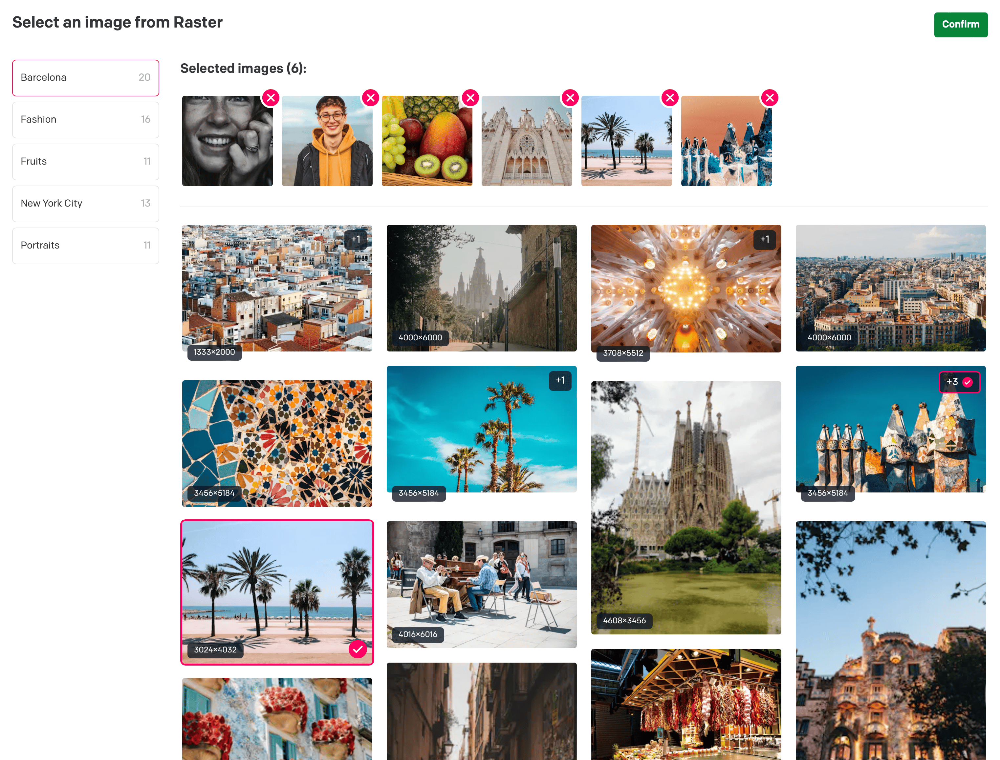

# Raster Dato Plugin

Getting images from Raster and use them in your DatoCMS project.

## Preparing to Use the Raster App in DatoCMS

Before using the app in DatoCMS an API key is needed, along with your Organization’s ID.

### Getting the Organization ID

To use the Raster app in DatoCMS, an Organization ID is required. You can get the Organization ID by navigating to `Organization name` `>` `Settings`. The Organization ID is the slug found after the [raster.app](http://raster.app/) URL.

## API Key

Similar to a required Organization ID, the Raster app in DatoCMS also needs an API Key. You can set up the API key and enable library level access by navigating to `Organization name` `>` `Settings`.

To enable APIs, follow these steps:

1. Generate a new key.
2. Enable `Read` access for the libraries you want to access via the API key.
3. Save your changes.
